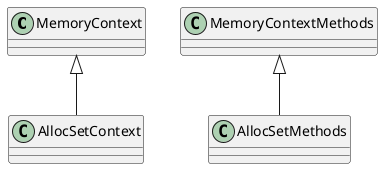

# 3. 第3章 存储管理
## 3.1. 存储管理器的体系结构


`PG`提供了轻量级锁，用于支持对共享内存中同一数据的互斥访问。

存储管理器的主要任务：


以读写元组的过程为例， 说明各个模块的使用顺序：


- 设置`cache`来存储系统表元组和表的基本信息；
- 首先从共享缓冲池查找所需文件对应的缓冲块
- 缓冲区和存储介质的交互式通过存储介质管理器`SMGR`来进行的，这是外存管理的核心
- 在磁盘管理器与物理文件之间还存在一层虚拟文件描述符`VFD`机制，防止进程打开的文件数超过操作系统限制，通过合理使用有限个实际文件描述符来满足无限的`VFD`访问需求。
- 在写入元组的时候，需要使用一定策略找到一个具有合适空闲空间的缓冲块，然后将该元组装填到缓冲块中。系统会在适当的时候将这些被写入数据的缓冲块刷回到存储介质中。
- 删除元组： 在元组上作删除标记，物理清除工作由`VACUUM`策略来完成。

## 3.2. 外存管理

外存管理体系结构：


### 3.2.1. 表和元组的组织方式
**堆文件的概念：**
同一个表中的元组按照创建顺序依次插入到表文件中，元组之间不进行关联，这样的表文件称为堆文件。

**堆文件的分类：**  
- 普通堆
- 临时堆 ： 会话过程中临时创建，会话结束自动删除
- 序列 ： 元组值自动正常的特殊堆
- TOAST表 ： 专门用于存储变长数据。  

堆文件的物理结构如下：  


`Linp`的类型是`ItemIdData`，如下所示：  
```cpp
typedef struct ItemIdData {
    unsigned lp_off : 15, /* offset to tuple (from start of page) */
        lp_flags : 2,     /* state of item pointer, see below */
        lp_len : 15;      /* byte length of tuple */
} ItemIdData;
```

使用`ItemIdData`来指向文件块中的一个元组。元组信息除了存放元组的实际数据，还存放元组头部信息， 通过`HeapTupleHeaderData`来描述， 在其中包含了删除标记位。
```cpp
typedef struct HeapTupleHeaderData {
    union {
        // 记录对元组执行操作的事务ID和命令ID， 用于并发控制时检查元组对事务的可见性
        HeapTupleFields t_heap;
        // 记录元组的长度等信息
        DatumTupleFields t_datum;
    } t_choice;

    ItemPointerData t_ctid; /* current TID of this or newer tuple */

    /* Fields below here must match MinimalTupleData! */

    uint16 t_infomask2; /* number of attributes + various flags */

    uint16 t_infomask; /* various flag bits, see below */

    uint8 t_hoff; /* sizeof header incl. bitmap, padding */

    /* ^ - 23 bytes - ^ */

    bits8 t_bits[FLEXIBLE_ARRAY_MEMBER]; /* bitmap of NULLs -- VARIABLE LENGTH */

    /* MORE DATA FOLLOWS AT END OF STRUCT */
} HeapTupleHeaderData;
```

`PostgreSQL`中使用了`HOT`技术， 用于在对元组采用多版本技术存储时占用存储过多的问题， 如果更新操作没有修改索引属性， 就不生成拥有完全相同键值的索引记录。

### 3.2.2. 磁盘管理器
主要实现在`md.c`, 通过`VFD`机制来进行文件操作。
```cpp
typedef struct _MdfdVec {
    // 该文件对应的`VFD`
    File mdfd_vfd;               /* fd number in fd.c's pool */
    // 这个文件是一个大表文件的第几段
    BlockNumber mdfd_segno;      /* segment number, from 0 */
    struct _MdfdVec *mdfd_chain; /* next segment, or NULL */
} MdfdVec;
```

### 3.2.3. VFD机制
绕过操作系统对于文件描述符数量的限制。

#### 3.2.3.1. 实现原理


当进程申请打开一个文件时，返回一个虚拟文件描述符，该描述符指的是一个`VFD`数据结构
一个进程打开的`VFD`存储在`VfdCache`中。
```cpp
typedef struct vfd
{
	int			fd;				/* current FD, or VFD_CLOSED if none */
    // 用于决定在关闭此文件时是要同步修改还是删除该文件
	unsigned short fdstate;		/* bitflags for VFD's state */
	ResourceOwner resowner;		/* owner, for automatic cleanup */
	File		nextFree;		/* link to next free VFD, if in freelist */
    // 指向比该VFD最近更常用的虚拟文件描述符
	File		lruMoreRecently;	/* doubly linked recency-of-use list */
    // 指向比该VFD最近更不常用的虚拟文件描述符
	File		lruLessRecently;
	off_t		seekPos;		/* current logical file position */
	off_t		fileSize;		/* current size of file (0 if not temporary) */
	char	   *fileName;		/* name of file, or NULL for unused VFD */
	/* NB: fileName is malloc'd, and must be free'd when closing the VFD */
	int			fileFlags;		/* open(2) flags for (re)opening the file */
	int			fileMode;		/* mode to pass to open(2) */
} Vfd;
static Vfd *VfdCache;
```

#### 3.2.3.2. LRU池
每个进程都是用一个`LRU`池来管理所有已经打开的`VFD`， 当`LRU`池未满时，进程打开的文件个数未超过操作系统限制；当`LRU`池满时，进程需要首先关闭一个`VFD`，使用替换最长时间未使用`VFD`的策略。

`LRU`池的数据结构如下所示：


### 3.2.4. 空闲空间映射表
对于每个表文件， 同时创建一个名为`关系表OID_fsm`的文件，用于记录该表的空闲空间大小， 称之为空闲空间映射表文件`FSM`。
使用一个字节来记录空闲空间范围大小。


为了实现快速查找， `FSM`文件使用树结构来存储每个表块的空闲空间，
块之间使用了一个三层树的结构， 第0层和第1层为辅助层，第2层FSM块用于实际存放各表块的空闲空间值。


每个`FSM`块大约可以保存`4000`个叶子节点， 三层树结构总共可以存储`4000^3`个叶子节点。


### 3.2.5. 可见性映射表
为了能够加快`VACUUM`查找包含无效元组的文件块的过程，在表中为表文件定义了一个新的附属文件——可见性映射表(VM)。

### 3.2.6. 大数据存储

## 3.3. 内存管理
存储管理的本质问题：如何减少`IO`次数。要尽可能让最近使用的文件块停留在内存中，这样能有效减少磁盘IO代价。


### 3.3.1. 内存上下文概述
内存上下文用于解决在以指针传值时造成的内存泄漏问题。
系统的内存分配操作在各种语义的内存上下文中进行，所有在内存上下文中分配的内存空间都通过内存上下文进行记录。
一个内存上下文实际上相当于一个进程环境， 进程环境中调用库函数(`malloc`/`free`/`realloc`)执行内存操作， 类似的， 内存上下文使用(`palloc`/`pfree`/`repalloc`)函数进行内存操作。

#### 3.3.1.1 MemoryContext
每一个子进程拥有多个私有的内存上下文，每个子进程的内存上下文组成一个树形结构。


```cpp
typedef struct MemoryContextData
{
	NodeTag		type;			/* identifies exact kind of context */
	MemoryContextMethods *methods;		/* virtual function table */
	MemoryContext parent;		/* NULL if no parent (toplevel context) */
	MemoryContext firstchild;	/* head of linked list of children */
	MemoryContext nextchild;	/* next child of same parent */
	char	   *name;			/* context name (just for debugging) */
	bool		isReset;		/* T = no space alloced since last reset */
} MemoryContextData;

typedef struct MemoryContextMethods {
    // 内存上下文操作的函数指针
    void* (*alloc)(MemoryContext context, Size size);
    /* call this free_p in case someone #define's free() */
    void (*free_p)(MemoryContext context, void* pointer);
    void* (*realloc)(MemoryContext context, void* pointer, Size size);
    void (*init)(MemoryContext context);
    void (*reset)(MemoryContext context);
    void (*delete_context)(MemoryContext context);
    Size (*get_chunk_space)(MemoryContext context, void* pointer);
    bool (*is_empty)(MemoryContext context);
    void (*stats)(MemoryContext context, int level);
#ifdef MEMORY_CONTEXT_CHECKING
    void (*check)(MemoryContext context);
#endif
} MemoryContextMethods;

/*
 * This is the virtual function table for AllocSet contexts.
 */
static MemoryContextMethods AllocSetMethods = {
	AllocSetAlloc,
	AllocSetFree,
	AllocSetRealloc,
	AllocSetInit,
	AllocSetReset,
	AllocSetDelete,
	AllocSetGetChunkSpace,
	AllocSetIsEmpty,
	AllocSetStats
#ifdef MEMORY_CONTEXT_CHECKING
	,AllocSetCheck
#endif
};
```

`MemoryContextMethods`方法是对`MemoryContext`类型的上下文执行的一系列操作。



在任何时候，都有一个当前的`MemoryContext`，其用`CurretMemoryContext`表示。
通过`MemoryContextSwitchTo`函数来修改当前上下文。

内存上下文的组织结构如下：  


层次结构如下：
- AllocSet
    - AllocBlockData
        - chunk

参考[PostgreSQL内存上下文学习](https://niyanchun.com/memorycontext-in-postgresql.html)， 内存块（block）和内存片（chunk）的区别如下：

AllocSetContext中有两个数据结构AllocBlock和AllocChunk，分别代表内存块和内存片，PostgreSQL就是使用内存块和内存片来管理具体的内存的。AllocSet所管理的内存区域包含若干个内存块（内存块用AllocBlockData结构表示），每个内存块又被分为多个内存片（用AllocChunkData结构表示）单元。我们一般认为内存块是“大内存”，而内存片是“小内存”，PostgreSQL认为大内存使用频率低，小内存使用频率高。所以申请大内存（内存块）使用的是malloc，并且使用完以后马上会释放给操作系统，而申请小内存（内存片）使用的是自己的一套接口函数，而且使用完以后并没有释放给操作系统，而是放入自己维护的一个内存片管理链表，留给后续使用。


```cpp
typedef AllocSetContext *AllocSet;
typedef struct AllocSetContext
{
	MemoryContextData header;	/* Standard memory-context fields */
	/* Info about storage allocated in this context: */
	AllocBlock	blocks;			/* head of list of blocks in this set */
	AllocChunk	freelist[ALLOCSET_NUM_FREELISTS];		/* free chunk lists */
	/* Allocation parameters for this context: */
	Size		initBlockSize;	/* initial block size */
	Size		maxBlockSize;	/* maximum block size */
	Size		nextBlockSize;	/* next block size to allocate */
	Size		allocChunkLimit;	/* effective chunk size limit */
	AllocBlock	keeper;			/* if not NULL, keep this block over resets */
} AllocSetContext;  

// 内存块使用`AllocBlockData`数据结构表示1
typedef struct AllocBlockData
{
	AllocSet	aset;			/* aset that owns this block */
	AllocBlock	next;			/* next block in aset's blocks list */
	char	   *freeptr;		/* start of free space in this block */
	char	   *endptr;			/* end of space in this block */
}	AllocBlockData;
```

核心数据结构为AllocSetContext，这个数据结构有3个成员MemoryContextData header;和AllocBlock blocks;和AllocChunk freelist[ALLOCSET_NUM_FREELISTS];。这3个成员把内存管理分为3个层次。
- 第1层是MemoryContext，MemoryContext管理上下文之间的父子关系，设置MemoryContext的内存管理函数。
- 第2层为AllocBlock blocks，把所有内存块通过双链表链接起来。
- 第3层为具体的内存单元chunk，内存单元Chunk是从内存块AllocBlock内部分配的，内存块和内存单元chunk的转换关系为：AllocChunk chunk = (AllocChunk)(((char*)block) + ALLOC_BLOCKHDRSZ);和AllocBlock block = (AllocBlock)(((char*)chunk) - ALLOC_BLOCKHDRSZ);。
内存单元chunk经过转换得到最终的用户指针，内存单元chunk和用户指针的转换关系为：((AllocPointer)(((char*)(chk)) + ALLOC_CHUNKHDRSZ))和((AllocChunk)(((char*)(ptr)) - ALLOC_CHUNKHDRSZ))。


#### 3.3.1.2 内存上下文初始化与创建
由函数`MemoryContextInit`完成。
先创建根节点`TopMemoryContext`， 然后在该节点下创建子节点`ErrorContext`用于错误恢复处理。

内存上下文的创建由`AllocSetContextCreate`实现：
- 创建内存上下文节点： `MemoryContextCreate`
    - 从`TopMemoryContext`节点中分配一块内存用于存放内存上下文节点
    - 初始化`MemoryContext`节点
    `context = (AllocSet)MemoryContextCreate(type, sizeof(AllocSetContext), parent, name, __FILE__, __LINE__);`
- 分配内存块
    - 填充`context`结构体
    根据最大块大小`maxBlockSize`来设置`allocChunkLimit`的值，在这里`allocChunkLimit`的决定函数是`f(ALLOC_CHUNK_LIMIT, ALLOC_CHUNKHDRSZ, ALLOC_BLOCKHDRSZ, ALLOC_CHUNK_FRACTION, maxBlockSize)`。
    - 如果`minContextSize > ALLOC_BLOCKHDRSZ + ALLOC_CHUNKHDRSZ`，调用标准库函数分配内存块， 预分配的内存块将计入到内存上下文的`keeper`字段中， 作为内存上下文的保留快， 以便重置内存上下文的时候， 该内存块不会被释放。

完成上下文创建之后， 可以在该内存上下文进行内存分配， 通过`MemoryContextAlloc`和`MemoryContextAllocZero`两个接口函数来完成。

#### 3.3.1.3 内存上下文中内存的分配
> 参考： [PostgreSQL内存上下文](http://shiyuefei.top/2018/01/11/PostgreSQL%E5%86%85%E5%AD%98%E4%B8%8A%E4%B8%8B%E6%96%87/)


|函数|功能|
|---|----|
|MemoryContextCreate|创建上下文节点|
|AllocSetContextCreate|创建上下文实例|
|MemoryContextDelete|删除内存上下文|
|MemoryContextReset|重置内存上下文|
|MemoryContextSwitchTo|切换当前上下文|
|palloc|在当前上下文中申请内存, 调用了当前内存上下文的`methods`字段中指定的`alloc`函数，调用了`AllocSetAlloc`|
|pfree|释放内存， 调用了当前内存上下文的`methods`字段中指定的`free_p`函数|
|repalloc|在当前上下文中重新申请内存， 调用了当前内存上下文的`methods`字段中指定的`ralloc`函数|


#### 3.3.1.4 内存上下文中的内存重分配
#### 3.3.1.5 释放内存上下文


### 3.3.2. 高速缓存
设立高速缓存提高访问效率，用于存放系统表元组(`SysCache`)和表模式信息(`RelCache`)。
`RelCache`中存放的是`RelationData`数据结构。

#### 3.3.2.1 SysCache

系统表数据结构： 
```cpp
typedef struct catcache
{
	int			id;				/* cache identifier --- see syscache.h */
	struct catcache *cc_next;	/* link to next catcache */
	const char *cc_relname;		/* name of relation the tuples come from */
	Oid			cc_reloid;		/* OID of relation the tuples come from */
	Oid			cc_indexoid;	/* OID of index matching cache keys */
	bool		cc_relisshared; /* is relation shared across databases? */
	TupleDesc	cc_tupdesc;		/* tuple descriptor (copied from reldesc) */
	int			cc_ntup;		/* # of tuples currently in this cache */
	int			cc_nbuckets;	/* # of hash buckets in this cache */
	int			cc_nkeys;		/* # of keys (1..CATCACHE_MAXKEYS) */
	int			cc_key[CATCACHE_MAXKEYS];		/* AttrNumber of each key */
	PGFunction	cc_hashfunc[CATCACHE_MAXKEYS];	/* hash function for each key */
	ScanKeyData cc_skey[CATCACHE_MAXKEYS];		/* precomputed key info for
												 * heap scans */
	bool		cc_isname[CATCACHE_MAXKEYS];	/* flag "name" key columns */
	Dllist		cc_lists;		/* list of CatCList structs */
#ifdef CATCACHE_STATS
	long		cc_searches;	/* total # searches against this cache */
	long		cc_hits;		/* # of matches against existing entry */
	long		cc_neg_hits;	/* # of matches against negative entry */
	long		cc_newloads;	/* # of successful loads of new entry */

	/*
	 * cc_searches - (cc_hits + cc_neg_hits + cc_newloads) is number of failed
	 * searches, each of which will result in loading a negative entry
	 */
	long		cc_invals;		/* # of entries invalidated from cache */
	long		cc_lsearches;	/* total # list-searches */
	long		cc_lhits;		/* # of matches against existing lists */
#endif
	Dllist		cc_bucket[1];	/* hash buckets --- VARIABLE LENGTH ARRAY */
} CatCache;						/* VARIABLE LENGTH STRUCT */
```

系统表的数据结构是一个以`CatCache`为元素的数组

```cpp
static CatCache *SysCache[
						  lengthof(cacheinfo)];
static int	SysCacheSize = lengthof(cacheinfo);
static const struct cachedesc cacheinfo[] = {
	{AggregateRelationId,		/* AGGFNOID */
		AggregateFnoidIndexId,
		1,
		{
			Anum_pg_aggregate_aggfnoid,
			0,
			0,
			0
		},
		32
	}
}
```

`cachedesc`结构如下所示：

```cpp
struct cachedesc
{
	Oid			reloid;			/* OID of the relation being cached */
	Oid			indoid;			/* OID of index relation for this cache */
	int			nkeys;			/* # of keys needed for cache lookup */
	int			key[4];			/* attribute numbers of key attrs */
	int			nbuckets;		/* number of hash buckets for this cache */
};
```


##### 3.3.2.1.1 SysCache 初始化
`SysCache`的初始化过程:
- InitCatalogCache
    - 循环调用`InitCatCache`根据`cacheinfo`中的每一个元素生成`CatCache`结构
        - 分配内存
        - 填充字段
- InitCatalogCachePhase2
    - 依次完善`SysCache`数组中的`CatCache`结构
        - 根据对应的系统表填充`CatCache`结构中的成员。


##### 3.3.2.1.2 CatCache 中缓存元组的组织
对应结构： 


##### 3.3.2.1.3 在 CatCache 中查找元组

`SearchCatCache`的作用： 在一个给定的`CatCache`中查找元组。

主要流程： 


#### 3.3.2.2 RelCache
- `RelCache`的初始化
- `RelCache`的插入
- `RelCache`的查询
- `RelCache`的删除

### 3.3.2.3 Cache同步
每个进程都有属于自己的`Cache`， 当某个`Cache`中的一个元组被删除或更新时，需要通知其他进程对其`Cache`进行同步。PG会记录下已经被删除的无效元组，并通过`SI Message`方式(共享消息队列方式)在进程之间传递这一消息。


`SI Message`的数据结构如下所示：

```cpp
typedef union
{
	int8		id;				/* type field --- must be first */
	SharedInvalCatcacheMsg cc;
	SharedInvalCatalogMsg cat;
	SharedInvalRelcacheMsg rc;
	SharedInvalSmgrMsg sm;
	SharedInvalRelmapMsg rm;
} SharedInvalidationMessage;
```

三种无效消息：
- `SysCache`中元组无效
- `RelCache`中元组无效
- `SMGR`无效(关闭表文件)

-------

进程通过调用函数`CacheInvalidateHeapTuple`对无效消息进行注册。


### 3.3.3. 缓冲池管理
如果需要访问的系统表元组在`Cache`中无法找到或者需要访问普通表的元组，就需要对缓冲池进行访。

需要访问的数据以 磁盘块 为单位调用函数`smgrread`写入缓冲池， `smgrwrite`将缓冲池数据写回到磁盘。 调入缓冲池中的磁盘块称为缓冲区、缓冲块或者页面， 多个缓冲区组成了缓冲池。

对共享缓冲区的管理采取了静态方式：在系统配置时规定好了共享缓冲区的总数
```
int NBuffers = 64;
```

> 我的小问题： 当前系统的`NBuffers`是多少？

通过追踪对应的数据结构，

```cpp
knl_instance_context g_instance;

knl_instance_context {
    knl_instance_attr_t attr;
}

typedef struct knl_instance_attr {

    knl_instance_attr_sql attr_sql;
    knl_instance_attr_storage attr_storage;
    knl_instance_attr_security attr_security;
    knl_instance_attr_network attr_network;
    knl_instance_attr_memory attr_memory;
    knl_instance_attr_resource attr_resource;
    knl_instance_attr_common attr_common;

} knl_instance_attr_t;

typedef struct knl_instance_attr_storage {
    int NBuffers;
}
```

答案是
```
p g_instance.attr.attr_storage.NBuffers

4096
```

-----


分类：
- 共享缓冲池： 要用作普通可共享表的操作场所
- 本地缓冲池： 仅本地可见的临时表的操作场所

对缓冲池的管理通过`pin`机制和`lock`机制完成。
- `pin`是缓冲区的访问计数器， 保存在缓冲区的`refcount`属性
    ```cpp
    typedef struct sbufdesc
    {
    	BufferTag	tag;			/* ID of page contained in buffer */
    	BufFlags	flags;			/* see bit definitions above */
    	uint16		usage_count;	/* usage counter for clock sweep code */
    	unsigned	refcount;		/* # of backends holding pins on buffer */
    	int			wait_backend_pid;		/* backend PID of pin-count waiter */
    
    	slock_t		buf_hdr_lock;	/* protects the above fields */
    
    	int			buf_id;			/* buffer's index number (from 0) */
    	int			freeNext;		/* link in freelist chain */
    
    	LWLockId	io_in_progress_lock;	/* to wait for I/O to complete */
    	LWLockId	content_lock;	/* to lock access to buffer contents */
    } BufferDesc;
    
    ```

- `lock`机制为缓冲区的并发访问提供了`EXCLUSIVE`锁和`SHARE`锁

#### 3.3.3.1 初始化共享缓冲池
`InitBufferPool`函数： 在共享缓冲区管理中， 使用了全局数组`BufferDescriptors`来管理池中的缓冲区。
```cpp
#define GetBufferDescriptor(id) (&t_thrd.storage_cxt.BufferDescriptors[(id)].bufferdesc)

typedef struct knl_t_storage_context {
    /*
     * Bookkeeping for tracking emulated transactions in recovery
     */
    TransactionId latestObservedXid;
    struct RunningTransactionsData* CurrentRunningXacts;
    struct VirtualTransactionId* proc_vxids;

    union BufferDescPadded* BufferDescriptors;
    // 存储缓冲池的起始地址
    char* BufferBlocks;
}

// 对缓冲区进行描述
typedef struct BufferDesc {
    BufferTag tag; /* ID of page contained in buffer */
    /* state of the tag, containing flags, refcount and usagecount */
    pg_atomic_uint32 state;

    int buf_id;    /* buffer's index number (from 0) */

    ThreadId wait_backend_pid; /* backend PID of pin-count waiter */

    LWLock* io_in_progress_lock; /* to wait for I/O to complete */
    LWLock* content_lock;        /* to lock access to buffer contents */

    /* below fields are used for incremental checkpoint */
    pg_atomic_uint64 rec_lsn;        /* recovery LSN */
    volatile uint64 dirty_queue_loc; /* actual loc of dirty page queue */
} BufferDesc;
```

数组元素的个数是缓冲区的总数， `BufferDescriptors`就是共享缓冲池。

缓冲区初始化流程： 


- 在共享内存中开辟内存
- `InitBufferPool` 初始化缓冲区描述符， 建立`Hash`表和`FreeList`结构
    - `ShmemInitHash`初始化缓冲区Hash表


#### 3.3.3.2 共享缓冲区查询
查询时， 以`BufferTag`作为索引键，查找Hash表并返回目标缓冲区在缓冲区描述符数组中的位置。
```cpp
typedef struct buftag
{
	RelFileNode rnode;			/* physical relation identifier */
	ForkNumber	forkNum;
	BlockNumber blockNum;		/* blknum relative to begin of reln */
} BufferTag;
```

缓冲区读取流程
```cpp
Buffer ReadBuffer(Relation reln, BlockNumber block_num)
{
    return ReadBufferExtended(reln, MAIN_FORKNUM, block_num, RBM_NORMAL, NULL);
        buf = ReadBuffer_common(reln->rd_smgr, reln->rd_rel->relpersistence, fork_num, block_num, mode, strategy, &hit);
            // 执行缓冲区替换策略
            bufHdr = BufferAlloc(smgr, relpersistence, forkNum, blockNum, strategy, &found);
}

```

`ReadBuffer_common`函数是所有缓冲区读取的通用函数， 其流程：  


`BufferAlloc`函数用于获得指定的共享缓冲区， 其流程：  


#### 3.3.3.3 共享缓冲区替换策略
##### 3.3.3.3.1 一般的缓冲区替换策略
在缓冲区中维护一个`FreeList`, `BufferStrategyControl`结构用于对`FreeList`进行控制。
```cpp
typedef struct
{
	/* Clock sweep hand: index of next buffer to consider grabbing */
	int			nextVictimBuffer;

	int			firstFreeBuffer;	/* Head of list of unused buffers */
	int			lastFreeBuffer; /* Tail of list of unused buffers */

	/*
	 * NOTE: lastFreeBuffer is undefined when firstFreeBuffer is -1 (that is,
	 * when the list is empty)
	 */

	/*
	 * Statistics.	These counters should be wide enough that they can't
	 * overflow during a single bgwriter cycle.
	 */
	uint32		completePasses; /* Complete cycles of the clock sweep */
	uint32		numBufferAllocs;	/* Buffers allocated since last reset */

	/*
	 * Notification latch, or NULL if none.  See StrategyNotifyBgWriter.
	 */
	Latch	   *bgwriterLatch;
} BufferStrategyControl;
```

在函数`StrategyGetBuffer`中， 当`FreeList`无法找到合适的缓冲区时， 通过`nextVictimBuffer`对所有缓冲区进行扫描，直到找到空闲缓冲区， 该过程使用`clock-sweep`算法实现。


##### 3.3.3.3.2 缓冲环替换策略
环形缓冲区可以使内存中的缓冲区可以重复利用， 通过数据结构`BufferAccessStrategyData`来控制。
```cpp
typedef struct BufferAccessStrategyData
{
	/* Overall strategy type */
	BufferAccessStrategyType btype;
	/* Number of elements in buffers[] array */
	int			ring_size;

	/*
	 * Index of the "current" slot in the ring, ie, the one most recently
	 * returned by GetBufferFromRing.
	 */
	int			current;

	/*
	 * True if the buffer just returned by StrategyGetBuffer had been in the
	 * ring already.
	 */
	bool		current_was_in_ring;

	/*
	 * Array of buffer numbers.  InvalidBuffer (that is, zero) indicates we
	 * have not yet selected a buffer for this ring slot.  For allocation
	 * simplicity this is palloc'd together with the fixed fields of the
	 * struct.
	 */
	Buffer		buffers[1];		/* VARIABLE SIZE ARRAY */
}	BufferAccessStrategyData;
```

#### 3.3.3.4 本地缓冲区管理
通过`InitLocalBuffer`来完成， 在使用时创建缓冲区。

缓冲区的获取主要通过调用`LocalBufferAlloc`函数来完成。

`LocalBufferAlloc`函数流程图如下所示： 


### 3.3.4. IPC
`IPC`有多重实现方法， 包括文件、`Socket`、共享内存等。`PostgreSQL`中的`IPC`主要采用共享内存的方式来实现。

PG的`IPC`机制提供的功能:
- 进程和`Postermaster`的通信机制
- 统一管理进程的相关变量和函数
- 提供了`SI message`机制
- 有关清楚的函数

#### 3.3.4.1 共享内存管理
在初始化过程中， 为共享内存创建了一个名为`ShmemIndex`的哈希索引。  
```cpp
static HTAB *ShmemIndex = NULL; /* primary index hashtable for shmem */

struct HTAB
{
	HASHHDR    *hctl;			/* => shared control information */
	HASHSEGMENT *dir;			/* directory of segment starts */
	HashValueFunc hash;			/* hash function */
	HashCompareFunc match;		/* key comparison function */
	HashCopyFunc keycopy;		/* key copying function */
	HashAllocFunc alloc;		/* memory allocator */
	MemoryContext hcxt;			/* memory context if default allocator used */
	char	   *tabname;		/* table name (for error messages) */
	bool		isshared;		/* true if table is in shared memory */
	bool		isfixed;		/* if true, don't enlarge */

	/* freezing a shared table isn't allowed, so we can keep state here */
	bool		frozen;			/* true = no more inserts allowed */

	/* We keep local copies of these fixed values to reduce contention */
	Size		keysize;		/* hash key length in bytes */
	long		ssize;			/* segment size --- must be power of 2 */
	int			sshift;			/* segment shift = log2(ssize) */
};
```

当试图为一个模块分配内存时，调用函数`ShmemInitStruct`，现在`ShmemIndex`索引中查找， 找不到再调用`ShmemAlloc`函数在内存中为其分配区域。

#### 3.3.4.2 SI Message
PostgreSQL在共享内存中开辟了`shmInvalBuffer`记录系统中所发出的所有无效消息以及所有进程处理无消息的进度。
```cpp
static SISeg *shmInvalBuffer;	/* pointer to the shared inval buffer */

typedef struct SISeg
{
	/*
	 * General state information
	 */
	int			minMsgNum;		/* oldest message still needed */
	int			maxMsgNum;		/* next message number to be assigned */
	int			nextThreshold;	/* # of messages to call SICleanupQueue */
	int			lastBackend;	/* index of last active procState entry, +1 */
	int			maxBackends;	/* size of procState array */

	slock_t		msgnumLock;		/* spinlock protecting maxMsgNum */

	/*
	 * Circular buffer holding shared-inval messages
	 */
	SharedInvalidationMessage buffer[MAXNUMMESSAGES];

	/*
	 * Per-backend state info.
	 *
	 * We declare procState as 1 entry because C wants a fixed-size array, but
	 * actually it is maxBackends entries long.
	 */
	ProcState	procState[1];	/* reflects the invalidation state */
} SISeg;
```

这里的`SISeg.buffer`采用了环形缓冲区结构。

`ProcState`结构记录了`PID`为`procPid`的进程读取无效消息的状态

```cpp
typedef struct ProcState
{
	/* procPid is zero in an inactive ProcState array entry. */
	pid_t		procPid;		/* PID of backend, for signaling */
	PGPROC	   *proc;			/* PGPROC of backend */
	/* nextMsgNum is meaningless if procPid == 0 or resetState is true. */
	int			nextMsgNum;		/* next message number to read */
	bool		resetState;		/* backend needs to reset its state */
	bool		signaled;		/* backend has been sent catchup signal */
	bool		hasMessages;	/* backend has unread messages */

	/*
	 * Backend only sends invalidations, never receives them. This only makes
	 * sense for Startup process during recovery because it doesn't maintain a
	 * relcache, yet it fires inval messages to allow query backends to see
	 * schema changes.
	 */
	bool		sendOnly;		/* backend only sends, never receives */

	/*
	 * Next LocalTransactionId to use for each idle backend slot.  We keep
	 * this here because it is indexed by BackendId and it is convenient to
	 * copy the value to and from local memory when MyBackendId is set. It's
	 * meaningless in an active ProcState entry.
	 */
	LocalTransactionId nextLXID;
} ProcState;

```

`SI Message`机制示意图：  


`SendSharedInvalidMessages`调用`SIInsertDataEntries`来完成无效消息的插入。


## 3.4. 表操作与元组操作
### 3.4.1. 表操作
### 3.4.2. 元组操作
## 3.5. VACUUM机制
### 3.5.1. VACUUM操作
### 3.5.2. Lazy VACUUM
### 3.5.3. Full VACUUM
## 3.6. ResourceOwner资源跟踪
## 3.7. 小结
