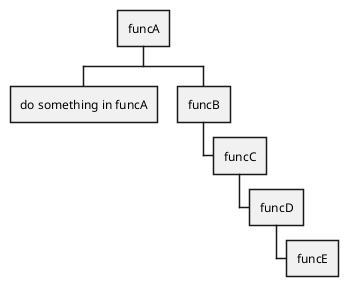

# 1. 阅读工作流
- 边调试边阅读，可以使用一些基本的case迅速打通业务主要逻辑，避开非关键的代码
- 记录阅读代码的笔记
    - 代码注释
    - 程序调用关系记录
    ```
    funcA
        funcB
            funcC
                funcD
                    funcE
    ```

    - 代码可视化
    可以基于程序调用关系结合`graphic`等工具生成调用图和流程图
- 提炼代码阅读过程中的设计模式、架构模型

# 2. 程序调用关系记录
自定义记录的格式如下：
```cpp
funcA
    {
    // do something in funcA
    // call funcB
    funcB
        funcC
            funcD
                funcE
    }
```

- `//`是对部分程序行为的一种提炼，通常用于描述函数内的某种行为
- 在描述一个函数内部的逻辑时可以用`{}`包含 ， 内部代码段不需要再缩进
- 除非有必要， 函数尽量只记录函数名或者是某个过程的函数调用语句

# 3. 代码可视化
在可视化时的几个关键问题是：
- 区分调用和顺序执行之间的关系
    - 思维导图
    - 类似pg源码解析中的调用约定
    
- 区分逻辑过程和函数过程
逻辑过程是按照业务维度划分的若干关键逻辑， 在函数组织上不一定是通过若干对等的逻辑完成， 可以在最粗粒度的层次使用传统的程序逻辑图历来表达这个过程。

## 3.1. 数据结构图
- oneNote
- Graphviz
    可配合项目[Graphvize](https://github.com/hao-lee/Graphvizer)使用  
    参考[Drawing graphs with dot - Graphviz](https://www.graphviz.org/pdf/dotguide.pdf)  

    - Open image window  
    Ctrl+Shift+G or Tools -> Graphvizer -> Open Rendered Image
    - Open Graphvizer panel  
    Ctrl+Shift+X or Tools -> Graphvizer -> Show Graphvizer Panel

    ```plantuml
    digraph g {
    node [shape = record,height=.1];
    node0[label = "<f0> |<f1> G|<f2> "];
    node1[label = "<f0> |<f1> E|<f2> "];
    node2[label = "<f0> |<f1> B|<f2> "];
    node3[label = "<f0> |<f1> F|<f2> "];
    node4[label = "<f0> |<f1> R|<f2> "];
    node5[label = "<f0> |<f1> H|<f2> "];
    node6[label = "<f0> |<f1> Y|<f2> "];
    node7[label = "<f0> |<f1> A|<f2> "];
    node8[label = "<f0> |<f1> C|<f2> "];
    "node0":f2 -> "node4":f1;
    "node0":f0 -> "node1":f1;
    "node1":f0 -> "node2":f1;
    "node1":f2 -> "node3":f1;
    "node2":f2 -> "node8":f1;
    "node2":f0 -> "node7":f1;
    "node4":f2 -> "node6":f1;
    "node4":f0 -> "node5":f1;
    }
    ```

    


## 3.2. 代码调用关系图
### 3.2.1. 调用关系图-无序
使用`Graphviz`的特性：

```plantuml
digraph G {
     main -> parse -> execute;
     main -> init;
     main -> cleanup;
     execute -> make_string;
     execute -> printf
     init -> make_string;
     main -> printf;
     execute -> compare;
}
```


### 3.2.2. 调用关系图-有序
```cpp
funcA
    {
    // do something in funcA
    // call funcB
    funcB
        funcC
            funcD
                funcE
    }
```

使用思维导图的效果一般， 使用`Work Breakdown Structure`的效果更好些


## 3.3. 程序流程图-plantuml


## 3.4. 程序流程图-drawio/flowchart


## 3.5. 类图-plantuml


## 3.6. UML图-plantuml


## 3.7. 软件架构图-drawio/flowchart


## 3.8. 网络拓扑图-drawio/network


## 3.9. 项目协作-drawio/flowchart
